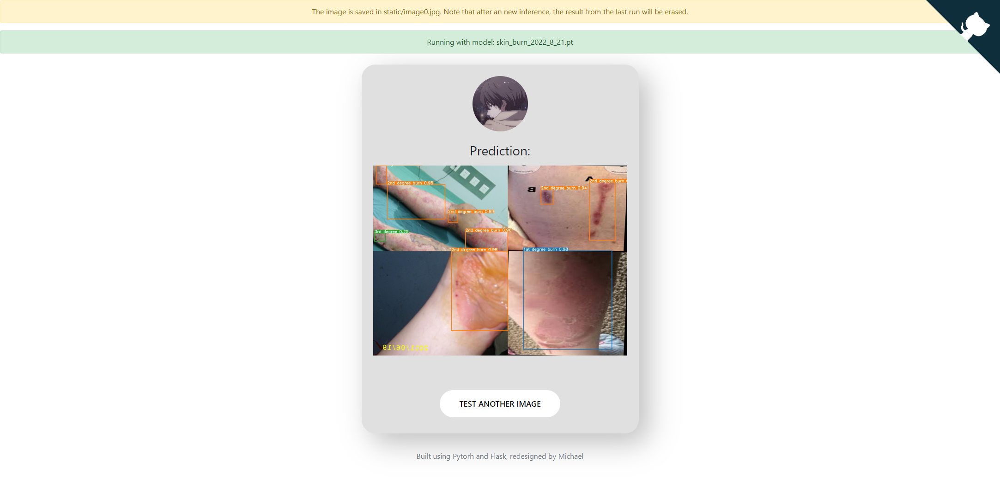

<H1 align="center">
Skin Burn Detection </H1>
<h4 align = "center">
Skin Burn Detector using Yolov7</h4>
<p align = "center">
  
  
  
  
</p>
<p align = "center"> <b> Author: Michael Wang</b> </p>
<p align = "center" style="bold">Supported Environment:</p> 
<div align = "center">
<a href="https://colab.research.google.com/">
  
  </a>
  <a href="https://github.com/">
  
  </a>
  <a href = "https://www.kaggle.com/"> 

    </a>
      <br>
</div>


<div align="center">
    English | <a href=".github/README_CN.md">简体中文</a>
	<br>
	<br>
	
</div>
																																										


## Project Overview:

The goal of this project is to develop a deep learning-based burn detection model that converts the burn detection problem into an object detection problem. Deep learning algorithms are then used to quickly locate burn locations in images and rank burn depths according to visual features of the images.


The burn detection precision has reached 88% and the mAP_0.5 has reached 72%, which is able to perform excellent burn depth determination and recognition in everyday medical situations. These improvements were made by modifying the network structure of the most recent Yolov7 model and using a variety of widely used target detection frameworks. This is the simplest and least expensive method of diagnosing burns that do not need expert assistance. It will play an important role in disaster relief and remote mountainous counties and towns with insufficient medical resources.

## Documentation:

### Quick Start:

The two easiest ways to get your feet wet is by directly running the notebooks created on Kaggle and Google Colab. The environments are already set up and you can directly train from scratch. (Aprox. 4-5 hours for one complete set of training) You may also find the notebooks directly in the notebooks folder. **However, note that these notebook cannot achieve the accuracy as mentioned in the paper or in this repo, because the dataset was trained on a public dataset rather than my own dataset used for this project. (Unfortunately I am unable to release my own dataset used due to privacy issues, but I will release the trained weights on my own dataset)**

**The Kaggle Notebook:**

<a href="https://www.kaggle.com/code/michaelwovo/skin-burn/notebook?scriptVersionId=103621232" target="_blank"></a><br>

**The Colab Notebook:**

<a href="https://colab.research.google.com/github/Michael-OvO/Burn-Detection-Classification/blob/main/notebooks/colab_skin_burn(demo).ipynb" target="_parent"></a>

### Running with Flask API

Flask is also an easy and quick alternative approach. It does not require any setup or run any python files to test with any images. For this project, I have already developed a Flask web app (run locally) that can analyze skin burn images from your own machine. 




To run this, please make sure you follow the steps below:

From the release page download the latest version of my released pre-trained model, and place it directly into the `./deployment/` folder, note that there should **only be one model at one time in this directory**, or else the script won't find the correct weight!

Make sure you have met the following requirements:

\- PyTorch >= 1.6

\- flask

\- and dependencies required by Yolov7 (if you git cloned this repo then simply run ``` pip install -r requirements.txt```) 

then, to launch the app, run the following command:

```bash
$ FLASK_ENV=development FLASK_APP=app.py flask run
```

then, visit http://localhost:5000/ in your browser.

You can search and download some skin burn images on the internet, or you can also use some pictures provided in the inference folder.

The framework can also be used on other yolov7 models as well as custom yolov7 models, so if you are interested in making one similar please check the following repo: [link to repo](https://github.com/Michael-OvO/Yolov7-Flask)

### Inferencing on your local machine (with the most accurate model):

####  Installation:

``` shell
# or just download this entire repo
git clone https://github.com/Michael-OvO/Burn-Detection-Classification.git
```

#### Install Dependencies (it is recommended that you set up a virtual environment through anaconda):

``` shell
cd Burn-Detection-Classification/
pip install -r requirements.txt
```

#### Begin Inferencing:

Download the pre-trained weights and place them into the same master folder: [Skin_burn_2022_8_21.pt](https://github.com/Michael-OvO/Burn-Detection-Classification/releases/download/v1.0.0/skin_burn_2022_8_21.pt)

The sample images can be found in the folder inference, the name of each image corresponds to the ground truth value of each image(the model should predict those values after each run).

Below is the file: `1st_degree_2.jpg` (which is sunburn so the model should know that it is first degree)

<div align="center">
    <a href="./">
        
    </a>
</div>


On video:

``` shell
python detect.py --weights Skin_burn_2022_8_21.pt  --source yourvideo.mp4
```

On image:
``` shell
python detect.py --weights Skin_burn_2022_8_21.pt --source inference/images/first_degree_2.jpg
```

<div align="center">
    <a href="./">
        
    </a>
</div>


## Export (Same  as  Yolov7: )

**Pytorch to CoreML (and inference on MacOS/iOS)** <a href="https://colab.research.google.com/github/WongKinYiu/yolov7/blob/main/tools/YOLOv7CoreML.ipynb"></a>

**Pytorch to ONNX with NMS (and inference)** <a href="https://colab.research.google.com/github/WongKinYiu/yolov7/blob/main/tools/YOLOv7onnx.ipynb"></a>

```shell
python export.py --weights yolov7-tiny.pt --grid --end2end --simplify \
        --topk-all 100 --iou-thres 0.65 --conf-thres 0.35 --img-size 640 640 --max-wh 640
```

**Pytorch to TensorRT with NMS (and inference)** <a href="https://colab.research.google.com/github/WongKinYiu/yolov7/blob/main/tools/YOLOv7trt.ipynb"></a>

```shell
wget https://github.com/WongKinYiu/yolov7/releases/download/v0.1/yolov7-tiny.pt
python export.py --weights ./yolov7-tiny.pt --grid --end2end --simplify --topk-all 100 --iou-thres 0.65 --conf-thres 0.35 --img-size 640 640
git clone https://github.com/Linaom1214/tensorrt-python.git
python ./tensorrt-python/export.py -o yolov7-tiny.onnx -e yolov7-tiny-nms.trt -p fp16
```

**Pytorch to TensorRT another way** <a href="https://colab.research.google.com/gist/AlexeyAB/fcb47ae544cf284eb24d8ad8e880d45c/yolov7trtlinaom.ipynb"></a> <details><summary> <b>Expand</b> </summary>


```shell
wget https://github.com/WongKinYiu/yolov7/releases/download/v0.1/yolov7-tiny.pt
python export.py --weights yolov7-tiny.pt --grid --include-nms
git clone https://github.com/Linaom1214/tensorrt-python.git
python ./tensorrt-python/export.py -o yolov7-tiny.onnx -e yolov7-tiny-nms.trt -p fp16

# Or use trtexec to convert ONNX to TensorRT engine
/usr/src/tensorrt/bin/trtexec --onnx=yolov7-tiny.onnx --saveEngine=yolov7-tiny-nms.trt --fp16
```

</details>

Tested with: Python 3.7.13, Pytorch 1.12.0+cu113

## Todos:

- [x] Finish Colab Notebook [2022.8.18]
- [x] Set up the rest of the code space [2022.8.21]
- [x] Add Chinese Markdown [2022.8.21]
- [x] Flask Environment for the trained model [2022.8.24]
- [x] Finish Paper [2022.8.26]

## Resources:

Please refer to the resources folder

- [x] Pretrained Models and weights
- [ ] Datasets
- [ ] Burn Guidelines
- [x] Appendix 1 [yolov5 runs]
- [x] Appendix 2 [yolov7 runs]
- [x] Appendix 3 [Hyp-evolution]
- [ ] Appendix 4
- [ ] Appendix 5
- [ ] Appendix 6

## Latest Updates:

<p align="center">
  
  
  
</p>

## Special Thanks:

I dedicate this space to those who helped me a lot in the process of doing this project, a huge shout-out to the following people mentioned below: 

  <a href="https://github.com/femj007"></a> <a href="https://github.com/XuChentianye"></a>  <a href="https://github.com/PeterZaipinai"></a>  <a href="https://github.com/goldenwill26"></a>  


## Acknowledgements

<details><summary> <b>Expand</b> </summary>

* [https://github.com/AlexeyAB/darknet](https://github.com/AlexeyAB/darknet)
* [https://github.com/WongKinYiu/yolor](https://github.com/WongKinYiu/yolor)
* [https://github.com/WongKinYiu/PyTorch_YOLOv4](https://github.com/WongKinYiu/PyTorch_YOLOv4)
* [https://github.com/WongKinYiu/ScaledYOLOv4](https://github.com/WongKinYiu/ScaledYOLOv4)
* [https://github.com/Megvii-BaseDetection/YOLOX](https://github.com/Megvii-BaseDetection/YOLOX)
* [https://github.com/ultralytics/yolov3](https://github.com/ultralytics/yolov3)
* [https://github.com/ultralytics/yolov5](https://github.com/ultralytics/yolov5)
* [https://github.com/DingXiaoH/RepVGG](https://github.com/DingXiaoH/RepVGG)
* [https://github.com/JUGGHM/OREPA_CVPR2022](https://github.com/JUGGHM/OREPA_CVPR2022)
* [https://github.com/TexasInstruments/edgeai-yolov5/tree/yolo-pose](https://github.com/TexasInstruments/edgeai-yolov5/tree/yolo-pose)
* [https://github.com/WongKinYiu/yolov7](https://github.com/WongKinYiu/yolov7)

</details>
